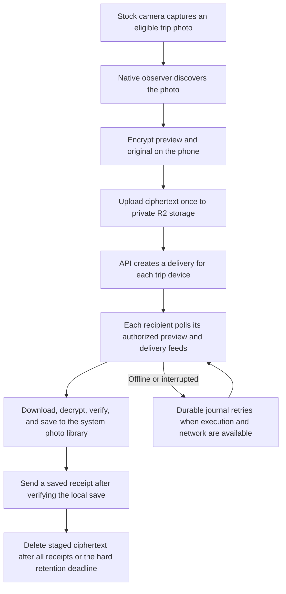

# Profiles, remembered devices, and photo delivery

This follow-up adds the [one-time name screen in Figma](https://www.figma.com/design/aJHBtfIOx8oc7BgbzbKJIa?node-id=93-169) to the existing onboarding implementation.

## Account and device flow

1. Sign in with a verified Clerk session.
2. If the account has no usable display name, ask **Your name.** A single name is sufficient; the app does not require a legal name or split a person's name into first and last names.
3. Save the name to Clerk. Authenticated `PUT /v1/profile` reads that account's canonical profile from Clerk and upserts CrewRoll's existing `users` row. The request cannot specify someone else's user ID or a replacement name. Deleted accounts cannot be resurrected. This operation never creates or rotates device credentials.
4. Remember a successful name sync in secure storage, scoped to the API and account. Failed syncs remain retryable. A returning account with the same name skips the name screen and the profile network write.
5. Native code restores the existing device session only when the account, installation, API origin, key material, and expiry are valid. Otherwise it registers or renews the installation. A valid cold start does not call `POST /v1/devices` again. Sign-out and account switching still invalidate access and pause old transfer work.
6. Recover the existing trip, then enter its gallery or the first-trip flow.

The saved profile marker is not an authentication credential. Registered-device binding is also distinct from hardware attestation or biometric verification. TLS and server authorization still apply to every network request.

## Photo transport

The current implementation is one-to-many delivery through temporary encrypted storage and durable per-device queues. It is not a peer-to-peer LAN broadcast or a WebSocket push transport.

Preview and original transfer lanes operate independently. A preview can appear in the gallery before the exact original has been saved. Received originals are excluded from camera discovery, preventing a sharing loop. The sender does not upload one copy per friend; recipients download their own authorized copy and acknowledge individually.

Trip keys are distributed in device-specific encrypted envelopes. Photo bytes are encrypted on the source phone and decrypted by members' native code. The service retains routing metadata and ciphertext, not plaintext photos or trip keys. Cloud cleanup also waits for issued upload URLs to expire so a delayed upload cannot recreate a deleted object. Photos already saved to members' libraries remain there.

Delivery timing depends on connectivity, photo permission, the trip's sharing window, and the operating system allowing the native work to run. Foreground emulator delivery is not evidence of reliable suspended or force-quit delivery on physical Android and iPhone devices.

## Acceptance

The profile hook checks successful reuse, duplicate taps, retry after a failed server sync, account switching, and a name changing during an outstanding sync. PostgreSQL checks confirm concurrent first syncs create one account, existing device records remain unchanged, and deleted accounts stay deleted. Native credential restoration already has account, installation, server, expiry, cleared-session, and damaged-key coverage.

Expo SDK 57 packages have been aligned to the compatible patch versions. Expo Doctor reports **21/21 checks passed**. The Android development APK completed a full native build and was installed as an update, preserving both accounts and their existing photo libraries.

### Emulator flow

One Android API 36 emulator was used with two isolated Android users. These are separate app installations and media libraries on one emulator, not two physical phones.

1. The guest completed the new name step as **Riya**. After the native upgrade, the saved profile, device session, active trip, and existing received original remained available.
2. The host completed the name step as **Ananya**. The compact 360 × 640 layout was checked with the Android keyboard open. Continue remains visible above the keyboard.
3. Both trip info and the photo filters read the saved host name. Filtering by Ananya shows both host photos; filtering by the guest shows the empty filtered result. Clearing filters restores both photos.
4. With the guest app stopped, the host took a new photo in the stock camera and resumed CrewRoll to upload it. The host app was then stopped. Resuming the guest received and saved that original automatically.
5. A guest process cold launch, followed by selecting the local bundle in the development launcher, returned to the gallery without repeating the name screen. The two MediaStore records stayed at IDs 19 and 20; no duplicate saves were created.

The JS API trace records two successful profile writes, one per account, and 20 successful trip reads. All 22 observed responses were HTTP 200. The final cold-launch segment contains three trip reads and no observed profile write or device-registration request. The trace attaches through the development debugger; it does not capture Clerk traffic, native transfer traffic, or guarantee coverage before attachment. Reuse is also covered by the profile and native session tests.

| Photo evidence                  | Source phone installation                                          | Guest phone installation                                           |
| ------------------------------- | ------------------------------------------------------------------ | ------------------------------------------------------------------ |
| Android user                    | 0                                                                  | 10                                                                 |
| New MediaStore record           | 27                                                                 | 20                                                                 |
| New original size               | 36,774 bytes                                                       | 36,774 bytes                                                       |
| New original SHA-256            | `752aa704b2abf7d06fdd983e40c7e96f5cb01beb639c61706e101d53282a1e1c` | `752aa704b2abf7d06fdd983e40c7e96f5cb01beb639c61706e101d53282a1e1c` |
| Existing original after upgrade | 38,257 bytes                                                       | 38,257 bytes                                                       |
| Existing original SHA-256       | `c22ad0b17d4987d5cfb5c0166c266f47939fc907c120cdc866e31a99115b0b1c` | `c22ad0b17d4987d5cfb5c0166c266f47939fc907c120cdc866e31a99115b0b1c` |

The new originals were compared as complete byte arrays after reading each installation's MediaStore record. The existing guest original was reread and hashed after the native upgrade.

### Automated and deployment checks

- App identity, formatting, lint, TypeScript, migration policy, and production module/export checks passed. No database migration is needed.
- The tool/policy suite covers 1,381 cases. The config policy initially caught two automatically added, unnecessary Expo plugins; they were removed and all six config-policy tests passed on rerun.
- The UI suite passed 688 tests with one existing skip before the keyboard adjustment. Afterward, one route-startup test hit its five-second timeout under build/resource contention; its complete 30-test file passed on rerun. A further profile recovery regression test verifies that editing after a failed sync keeps the form visible. The final combined profile, session, and route rerun passed all 83 tests; final TypeScript and scoped lint checks also passed.
- The contracts/backend suite passed 763 cases and hit one fresh-import timeout while the native build was active. The entire 49-test runtime file passed when rerun without the native build. No timeout was raised or assertion weakened.
- The three new real-PostgreSQL tests passed: concurrent profile creation, preserving device credentials, and rejecting deleted accounts. The temporary test database was stopped and removed.
- The profile endpoint was deployed in Worker version `3dfca03e-cf79-46cd-9606-c0e973279567`. An unauthenticated request returns 401; both authenticated emulator submissions returned 200.
- The existing Figma file now includes the conditional name step. Its three navigation edges are valid, and all 31 current onboarding navigation edges resolve to existing frames.

### Visual evidence and limits

- [Name screen](../../outputs/crewroll-profile-device/01-name-screen.png)
- [Guest gallery after native upgrade](../../outputs/crewroll-profile-device/02-guest-upgraded-gallery.png)
- [Compact screen with keyboard](../../outputs/crewroll-profile-device/03-compact-keyboard.png)
- [Named crew in trip info](../../outputs/crewroll-profile-device/04-named-crew.png)
- [Named photo filters](../../outputs/crewroll-profile-device/05-named-filters.png)
- [Gallery after cold launch](../../outputs/crewroll-profile-device/06-cold-launch-gallery.png)
- [Machine-readable acceptance](../../outputs/crewroll-profile-device/acceptance.json)

Physical Android/iPhone background delivery, force-quit behavior, iOS app layout, and provider sign-in with real Google/Apple accounts remain separate acceptance work. This emulator run does not establish those results. There was no physical phone attached during this pass.
